# cavitation_detection_pump
TinyML system for firefighting pump anomaly detection using ESP32 &amp; ADXL345. It employs a custom autoencoder trained on self-collected vibration data via Edge Impulse to monitor vibrations in real-time, detect cavitation, and trigger automatic shutdown to prevent equipment damage.


------------------------------------------------------------------------------------------------------------------------------------------------------------------------------------------------------------------------

<h1><b></b>FIREFIGHTING’S PUMPS CAVITATION DETECTOR


**USEFUL LINKS:**

- GITHUB REPOSITORY:

<https://github.com/gleali006-hub/pump_cavitation_detector>

- EDGEIMPULSE PROJECT:

<https://studio.edgeimpulse.com/public/831755/live>

- KNIME WORKFLOWS:
  
  <https://hub.knime.com/gabriele_leali/spaces/Public/Cavitation%20detector~uu0xBp0oy2maPc_-/>

<h1>TECHNICAL DESCRIPTION**

**INDEX:**

> 1-INTRODUCTION
>
> *Problem definition and aim of the project*
>
> 2-HARDWARE
>
> *The board*
>
> *The accelerometer*
>
> *Complete acquisition circuit*
>
> 3-SOFTWARE
>
> *Acquisition system code*
>
> *The algorithm*
>
> 4-DATA COLLECTION
>
> *Vibration measurement*
>
> *Data processing*
>
> *Analysis of data collected*
>
> 5-THE MODELS
>
> *Vibratory Signal Prediction*
>
>*Small autoencoder*
>
> *Extended autoencoder*
>
> 6-MODEL EVALUATION
>
> *Performance achieved*
>
> *Normal-abnormal limit threshold calculation*
>
> 7-DEPLOYMENT: EDGEIMPULSE
>
> *From the model to the application*
>
> *The code*
>
> 8-COMPLETE PRODUCT HYPOTHESIS
>
> 9-TESTS
>
> 10-CONCLUSION
>
> 11-FUTURE DEVELOPMENTS

1.  **INTRODUCTION:**

The idea of this project stems from my experience in the volunteering
group “Volontari del Garda” in Salò (BS), Italy, a group of volunteers
operating in rescue, civil protection and firefighting, and in
particular in the forest firefighting sector, in which I am a volunteer.

During firefighting operations in mountain environments, transporting
water from a source in the valley to high altitude up the mountainside,
to bring it closer to the fire front, is often necessary.

One of the most often used techniques, given that distances and
differences in height are often significant and a single motor pump is
not powerful enough, is to compose a line of motor pumps. The water is
pumped through several stations, each located at the head limit of the
previous motor pump, where it is raised higher by a new motor pump. The
most logical idea for non-experts in the sector would be to attach the
outlet of the next one directly to the suction of a motor pump; however,
this is rarely done due to the high risk of sending the motor pumps into
cavitation. The fire hoses used to transport water are soft, and as long
as they have a positive pressure inside them they remain inflated, but
if the suction pressure of a motor pump exceeds the pressure arriving
inside the hose connected to it, it crushes on itself, closing the
passage of water and suddenly generating a vacuum inside the pump
impeller, favouring the phenomenon of cavitation which often irreparably
damages the impeller, putting the pump out of action.

Unfortunately, this situation often occurs during a fire extinguishing
campaign, favored by the difficult situation and environment, as well as
the urgency of the procedures to prevent the fire from spreading.

To overcome this problem, the "old school" approach, which is more
widespread and safer, is to set up a tank for each intermediate station,
so that the booster pump can draw from here and always has a water tank
available from which to draw, avoiding the risk of cavitation. However,
this lengthens considerably and complicates the preparation of the line,
as it is necessary to bring more material (the tanks) to height, often
work is done on a slope so it is necessary to dig an adequate flat space
on which to mount the tank (usually about 1mx1m) and mount the tank,
requiring time (more precious than ever with an advancing fire), effort,
equipment and personnel.

A second, less common but easier approach, is to set up a "direct" line,
i.e. with the motor pumps attached one after the other; In this case, to
overcome the problem of cavitation (or reduce, since in my personal
experience at least a pump broke every fire anyway) at least one
operator is always left near the pump to constantly check the pump and
to stop it immediately in case of any problem. In this case, although
the assembly of the line is simpler, during its operation, it is always
necessary to leave at least one or more often two operators for each,
thus requiring a great commitment of personnel. In addition, great
attention is always needed as the phenomenon happens quickly.

The goal of this work is to design and implement a system capable of
analysing pump operation—specifically its vibration patterns—to
determine whether it is functioning under normal conditions or
approaching an anomalous state. Integrated into a dedicated board
connected to the pump motor, this system would be able to shut the pump
down to prevent damage, effectively replacing the need for an operator
in this monitoring task.

To accomplish this, a machine learning model was trained and then
deployed on a microcontroller connected to an accelerometer mounted on
the pump (vibrations were chosen as the metric to evaluate the pump's
operation).

Since collecting abnormal vibration data would damage the pump, the
model is trained exclusively on “normal” operating data, learning to
accurately reconstruct only these patterns. As a result, when an
anomalous signal is encountered, the reconstruction quality degrades. By
calculating the reconstruction error, it becomes possible to assess the
current state of the pump and detect potential anomalies.

2.  **HARDWARE:**

For this project, therefore, a system to measure and capture pump
vibration data is first required.

The choice was to assemble the system independently, using a
programmable microcontroller to which an accelerometer can be connected,
so that the same hardware, suitably expanded, can also be used in the
future to make the finished product, i.e. the system that turns off the
pump in the event of anomalies. Given my knowledge and previous
experience in the Arduino world, I decided to stay in this ecosystem and
look for suitable boards, powerful enough for both data-logging and
tinyML tasks.

The choice fell on the ESP32 C3 board in the Supermini version, as it
has a high computational capacity, compatibility with the Arduino world
and so easily interfaceable with EdgeImpulse (which allows generating an
Arduino library from a ML model) and low cost, a mandatory requirement
when considering a future large-scale use on all the pumps deployed in
firefighting campaigns, especially if owned by volunteers groups with
limited budget.

**THE BOARD: ESP32C3**

In detail, the SuperMini DevKit ESP32C3 board is a development module
that integrates the System on a Chip (SoC) ESP32C3 produced by Espressif
Systems, belonging to the ESP32 family, designed for embedded
applications that require high computing performance in a compact
format. The microcontroller integrates a 32-bit RISCV core with a clock
frequency of up to 160 MHz, capable of performing 32-bit operations with
a hardware multiplication unit (MAC) and support for multiplication and
division instructions in hardware, making it suitable for real-time
signal and algorithm processing.

The board is equipped with 400 KB of internal SRAM and 384 KB of ROM,
flanked by a 4 MB external flash memory connected via QSPI interface,
which allows code execution directly from the external memory (XIP –
eXecute In Place). This configuration provides enough space for complex
firmware and for handling large data buffers, such as tinyML algorithms.
In addition, the integration of hardware accelerators for cryptography
(such as AES, SHA, RSA) helps improve overall efficiency, freeing up the
main core for AI inference operations.

Among the available wired communication interfaces are UART, SPI, I²C
and I²S, useful for connecting the board to sensors, data acquisition
modules or output devices, such as the accelerometer that we will use.
In particular, the I2C protocol will be used. The ESP32-C3 SoC
integrates an I2C controller that can operate in both master and slave
modes. The I2C bus supports several speeds, including standard mode (100
Kbit/s) and fast mode (400 Kbit/s), with the ability to reach up to 800
Kbit/s. The flexibility of the I/O system also allows the selection of
I2C pins from any available GPIO through the GPIO Matrix, facilitating
signal routing and circuit design. Having only one sensor we are not
interested in being able to specify different pins for communication at
the moment; however, it can be an advantageous feature if in the future
it is thought to make the system more precise by expanding the amount of
data analysed. Given the speed of vibratory phenomena, on the other
hand, the possibility of reaching high communication speeds is a very
interesting feature.

The SuperMini format of the DevKit minimizes board size while
maintaining access to the generic I/O pins (GPIOs). There is also a
built-in 12-bit ADC converter, which allows the direct acquisition of
analog signals, useful in monitoring and data acquisition applications,
which, however, won’t be used as our accelerometer is digital. An
important characteristic of ESP32C3 is low energy consumption. Under
standard operating conditions, the typical current consumption is about
28 mA, when the processor is active in idle mode at the maximum
frequency of 160 MHz. This feature, combined with its compactness, makes
the board particularly suitable for our purpose, which is a portable
device, ready to be installed for use where it is needed, without having
a main power supply, and being able to run on battery power for a long
period of time. Furthermore, although the ESP32-C3 platform is natively
supported by the ESP-IDF (Espressif IoT Development Framework), its
excellent integration with the Arduino IDE was a considerable advantage
for me in carrying out the project, especially for the integration with
EdgeImpulse.

Finally, it is important to point out that the ESP32-C3 SoC natively
includes modules for Wi-Fi and Bluetooth wireless connectivity. For the
specific application of this work, which involves data processing
without the need for remote transmission, these features have not been
used. Therefore, their presence did not influence the final decision,
and they were not taken into account during the development phase, which
focused exclusively on the computing capabilities and wired interfaces
of the microcontroller.

<figure>
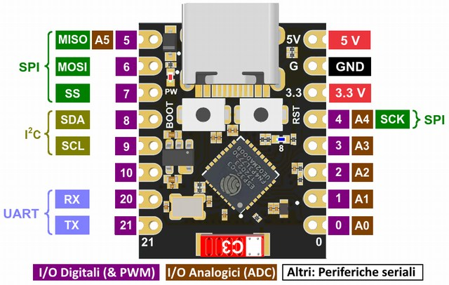
<figcaption><p>Image : Pinout of the ESP32C3 DevKit</p></figcaption>
</figure>

**ACCELEROMETER**

Choosing the accelerometer to pair with the microcontroller was easier.
One of the most used models in Arduino projects is the ADXL345; my
choice was also confirmed by studies that I found while organizing my
work, where this accelerometer was used to measure pump vibrations,
validating it for my purpose.

<figure>
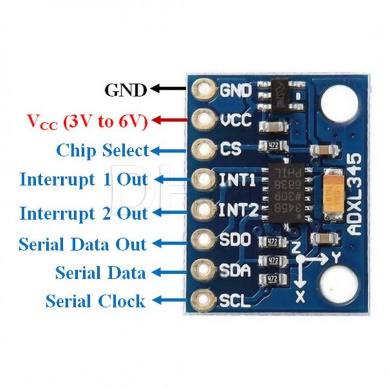
<figcaption><p>Image : ADXL345 pinout</p></figcaption>
</figure>

The ADXL345 is a low-power digital accelerometer, manufactured by Analog
Devices, designed to measure accelerations in three axes (X, Y, Z) with
high sensitivity and good accuracy. It is particularly suitable for
portable or embedded applications due to its low power consumption and
small physical footprint.

The sensor can measure accelerations in a selectable range of ±2 g to
±16 g, with up to 13-bit resolution. In standard measurement mode, the
typical sensitivity is 4 mg/LSB at ±2 g, making it suitable for
detecting vibration, shock, tilt, or slow movement.

The ADXL345 uses an SPI or I²C digital interface for data transmission,
making it easily integrable with microcontrollers, including my ESP32.
It features an internal 32-sample FIFO buffer that reduces the workload
on the microcontroller, especially during high-frequency sampling.

The power consumption is extremely low: in active measurement mode at
100 Hz, the typical power consumption is about 140 μA, making it
suitable for a battery-powered device, as in this case.

The sensor operates with a supply voltage between 2.0 V and 3.6 V, so it
is easily connected to our microcontroller operating at 3.3V.

For communication with the main board I opted for the I2C protocol,
which uses only two pins in addition to power and seemed the easiest to
implement. It was also the richest in examples and explanations and I
had already used it successfully several times in other projects.

**COMPLETE ACQUISITION CIRCUIT**

The circuit for datalogging is therefore as follows:

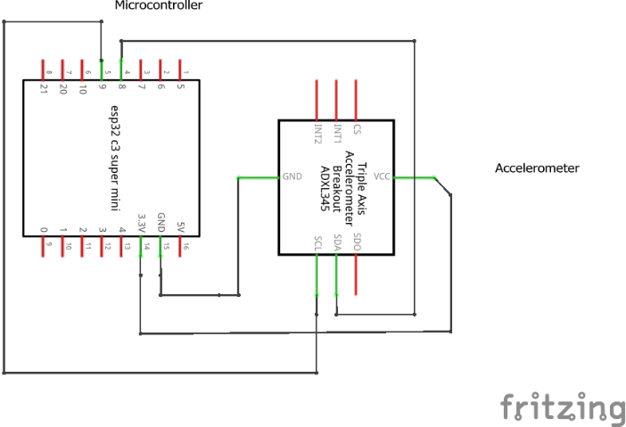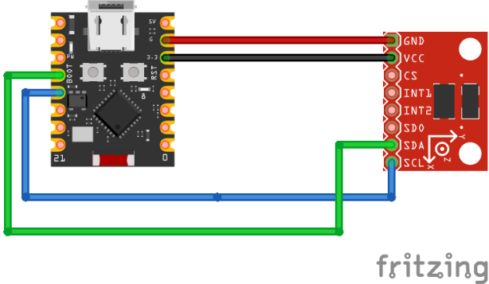

Image : Datalogging circuit wiring diagram and circuit

I soldered the two components together with wires about 30 cm long
between them to facilitate the installation on the pump.

<figure>

<figcaption><p>Image : The two acquisition systems
built</p></figcaption>
</figure>

As you can see from the image, the accelerometer has been screwed onto a
flexible plastic plate to facilitate installation on the pump.

<figure>
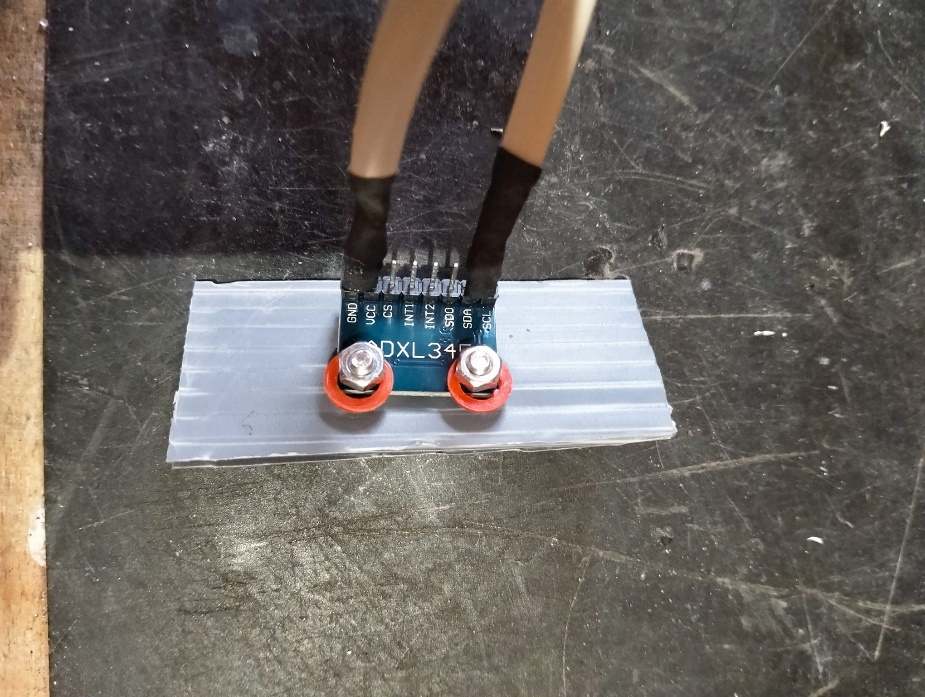
<figcaption><p>Image : Support to install the
accelerometer</p></figcaption>
</figure>

In the datalogging phase, the circuit will be powered directly via USB
from the computer to which it is connected to save the data.

3.  **SOFTWARE**

**ACQUISITION SYSTEM CODE**

First, I wrote the sketch for data acquisition, which was loaded on the
ESP32 with Arduino IDE. You can find this sketch in the Github
repository of the project in the “Data” folder. The I2C protocol is used
for communication with the accelerometer; the instructions for this
protocol are contained in the "Wire.h" library. On this board, the
protocol uses pins 8 (SDA) and 9 (SCL).

The code reads one by one the data sent on the I2C bus by the sensor and
sends them back to the COM port to which the computer is connected via
USB, separating the x, y and z values with a space character, and the
various lines of data between them with a carriage line character.

After various tests, the highest acquisition frequency obtained with the
acquisition system is 515 Hz, a value considered suitable because, in
accordance with Nyquist's theorem, it allows us to read data with a
frequency up to 515/2=257.5 Hz, or 15450 RPM, a value much higher than
the rotation speed of the 4-stroke motor that moves the pump impeller.

**THE ALGORITHM**

As said before, since no anomalous data is available, the idea is to
"teach" the algorithm to predict normal operation, and then classify
everything that deviates from the learned behaviour as a potential
anomaly. This is a typical anomaly detection problem, which is usually
solved using a specific neural network structure: the autoencoder, which
we’ll adopt as well.

**THE AUTOENCODER**

An autoencoder is a type of artificial neural network used for
unsupervised learning. Its main objective is to learn a compressed and
efficient representation (coding) of a set of data, generally in order
to reduce dimensionality, extract salient features and learn to
reconstruct its input. It consists of two main parts: an encoder, which
compresses the input data into a low-dimensional latent space, and a
decoder, which reconstructs the original data from this compressed
representation. By forcing data through this small-scale "bottleneck,"
the network must learn to identify and preserve the most important
features.

The architecture of an autoencoder is composed of an encoding function
and a decoding function, which are usually simple feed-forward networks.
In detail:

- Encoder: This part of the network takes high-dimensional input data
  and maps it into a low-dimensional latent representation. This
  compressed vector captures the central essence of the input data.

- Bottleneck: This is the layer that contains the compressed
  representation of the input in latent space. It is the middle layer of
  the autoencoder. In our specific case, it has dimension of two neurons

- Decoder: This part takes the compressed representation from the
  bottleneck and tries to reconstruct the original input data to high
  dimensionality, returning the data to its original form.

<figure>
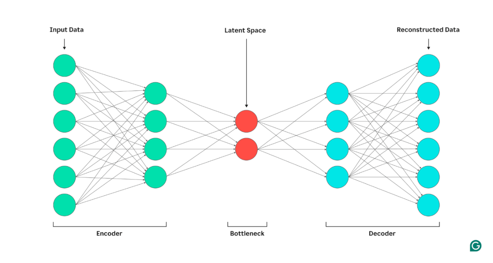
<figcaption><p>Image : Generic autoencoder structure</p></figcaption>
</figure>

This structure is particularly useful in anomaly detection problems,
especially when there is not (as almost always) a significant amount of
"anomalous" data.

The autoencoder is therefore trained only on examples of "normal"
operation. Since the model has seen only normal distributions, for an
anomalous signal the reconstruction will be worse on average; The
*Reconstruction Error* becomes the anomaly measure.

<figure>
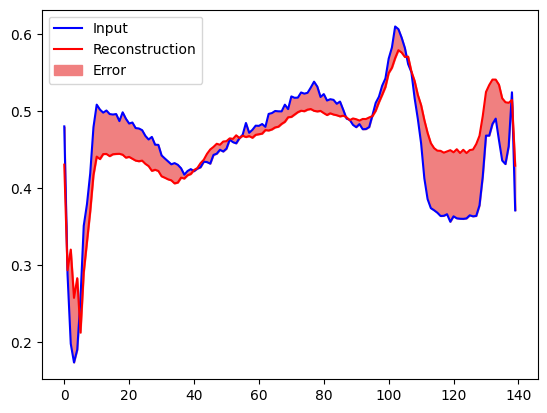
<figcaption><p>Graph : Reconstruction error</p></figcaption>
</figure>

Once we have the model that reconstructs the normal data, to do anomaly
detection, we will have to find a threshold value to consider as a limit
for the *reconstruction error*, beyond which we will be alerted because
we are going up against an anomaly.

4.  **DATA COLLECTION:**

For the realization of an algorithm of this type, it is essential to
have a good amount of data available that represent the various normal
operating conditions of the pump.

Once the datalogging system was ready, thanks to the “Gruppo Volontari
del Garda” that kindly lent me their pumps, I proceeded with the
measurement of the vibrations.

**VIBRATION MEASUREMENT**

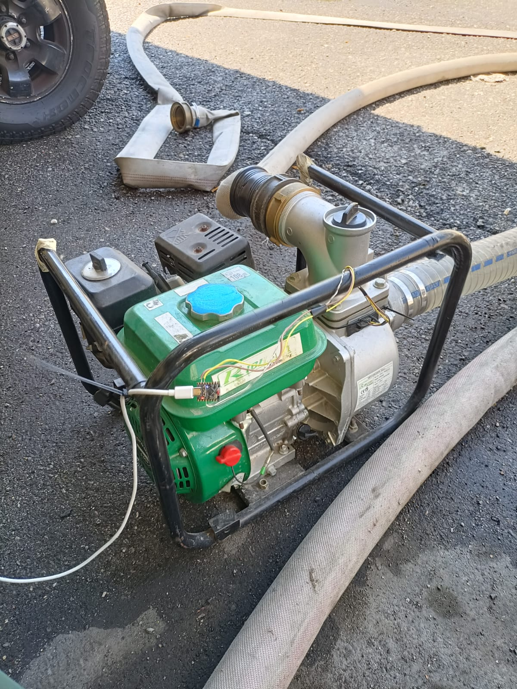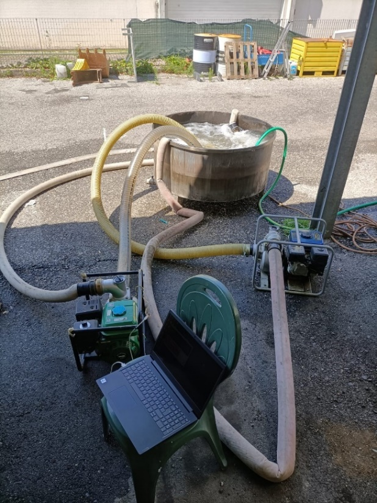

Image : Vibration Measurement Image : Mounting the acquisition system

<table style="width:50%;">
<colgroup>
<col style="width: 28%" />
<col style="width: 11%" />
<col style="width: 9%" />
</colgroup>
<thead>
<tr>
<th colspan="2" style="text-align: center;"><strong>MOTOR PUMP NO. 1:
RIBIMEX GNB30H1</strong></th>
<th style="text-align: center;"></th>
</tr>
</thead>
<tbody>
<tr>
<td style="text-align: center;">Mass</td>
<td>28 kg</td>
<td></td>
</tr>
<tr>
<td colspan="2" style="text-align: center;">Engine (4t)</td>
<td style="text-align: center;"></td>
</tr>
<tr>
<td style="text-align: center;">Piston displacement</td>
<td>163cc</td>
<td></td>
</tr>
<tr>
<td style="text-align: center;">Power</td>
<td>3.50 kW</td>
<td></td>
</tr>
<tr>
<td colspan="2" style="text-align: center;">Pump</td>
<td style="text-align: center;"></td>
</tr>
<tr>
<td style="text-align: center;">Discharge head</td>
<td>28 m</td>
<td></td>
</tr>
<tr>
<td style="text-align: center;">Suction head</td>
<td>7 m</td>
<td></td>
</tr>
<tr>
<td style="text-align: center;">Pumping capacity</td>
<td>66 m³/h</td>
<td></td>
</tr>
<tr>
<td style="text-align: center;">Fittings Dimension</td>
<td>80 mm</td>
<td></td>
</tr>
</tbody>
</table>

Table 1: Motor pump features

The accelerometer was positioned in the upper part of the pump impeller
casing, near the pump outlet, in an area where I could find sufficient
contact surface. Given the absence of anchors, it was fixed with plastic
cable ties that surrounded the entire casing.

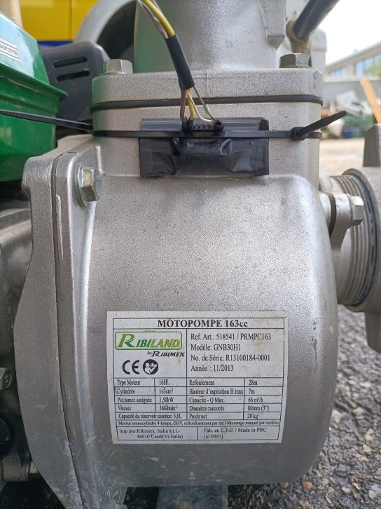
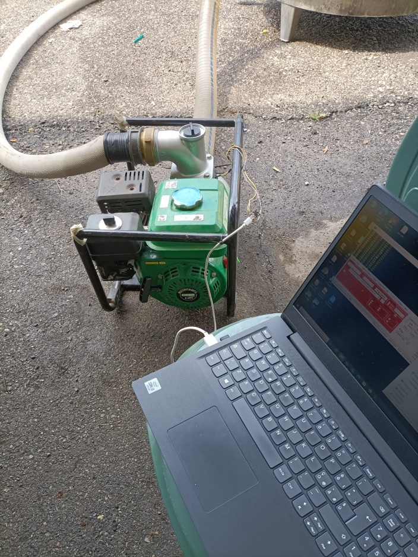

Image : Accelerometer fixing Image : Datalogging system

The acquisition system was connected via USB to the computer, from which
it received power and to which the measured data were sent, saved with
the use of the software Realterm. For each sample, the timestamp was
added in YMDHS format.

The motor pump, which cannot operate without water inside them, was
connected to a recirculating system in a tank of approximately 300
liters of water, from which it drew water with its special dip tube and
into which it pumped the water with a hose of a few meters. I decided to
record several files of a few minutes that represent the various
operating conditions of the pump, trying to include all possible
situations: (recoil start) ignitions, operation at various speeds,
shutdown, acceleration and deceleration.

The table below shows a summary of the various data collected with a
brief description.

<table>
<caption><p>Table : Description of collected measurement
files</p></caption>
<colgroup>
<col style="width: 25%" />
<col style="width: 74%" />
</colgroup>
<thead>
<tr>
<th colspan="2" style="text-align: center;"><strong>MOTOR PUMP
1</strong></th>
</tr>
</thead>
<tbody>
<tr>
<td style="text-align: center;"><strong>FILE NAME</strong></td>
<td style="text-align: center;"><strong>DESCRIPTION</strong></td>
</tr>
<tr>
<td style="text-align: center;"><em><strong>1max</strong></em></td>
<td style="text-align: center;">Long recording with constant gas at
maximum</td>
</tr>
<tr>
<td style="text-align: center;"><em><strong>2med</strong></em></td>
<td style="text-align: center;">Long recording with constant gas about
half power</td>
</tr>
<tr>
<td style="text-align: center;"><em><strong>3variaz</strong></em></td>
<td style="text-align: center;">Medium throttle start with mild
acceleration and deceleration, held stationary for about a minute, then
full acceleration.</td>
</tr>
<tr>
<td style="text-align: center;"><em><strong>4med</strong></em></td>
<td style="text-align: center;">Long recording with constant gas about
halfway</td>
</tr>
<tr>
<td
style="text-align: center;"><em><strong>5variazsugiu</strong></em></td>
<td style="text-align: center;">Start at minimum, increase to mid-level
and hold briefly, then reach maximum; after a few minutes, decelerate to
about one-third, then to minimum, and stop the recording.</td>
</tr>
<tr>
<td style="text-align: center;"><em><strong>6spenta</strong></em></td>
<td style="text-align: center;">Short recording with pump off</td>
</tr>
<tr>
<td
style="text-align: center;"><em><strong>7accenspegn</strong></em></td>
<td style="text-align: center;">Start the pump (pull start) at medium
throttle, accelerate to maximum, then decelerate to minimum and switch
off.</td>
</tr>
<tr>
<td
style="text-align: center;"><em><strong>8accenspoiblocca</strong></em></td>
<td style="text-align: center;"><p>Start at low RPM (near minimum),
accelerate to about mid-level, then the recording stops.
</tr>
<tr>
<td style="text-align: center;"><em><strong>9completo</strong></em></td>
<td style="text-align: center;">Start at low RPM (near idle), accelerate
to mid-level and hold, then to maximum, hold briefly, gradually
decelerate to half, then one-third, return to idle, and finally switch
off.</td>
</tr>
</tbody>
</table>

All datasets were saved in ".csv" format. The position of the
accelerometer axes in the system was as follows.

<figure>
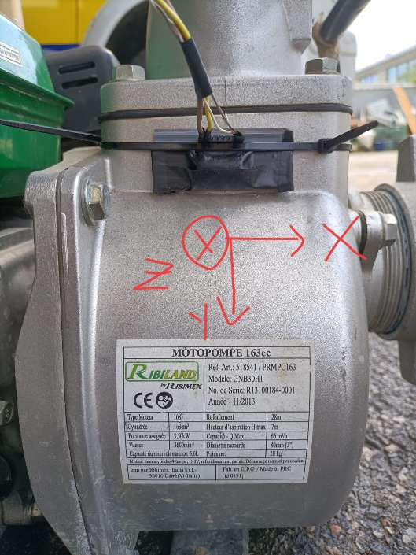
<figcaption><p>Image : Accelerometer reference system</p></figcaption>
</figure>

Note that the throttle control in the pump is a small manual lever,
which has no references in its stroke. It is therefore very difficult to
position the lever in a precise position (apart from maximum and
minimum); for this reason, the recordings with "half throttle" are
slightly different from each other.

Let’s have a brief look at the collected data.

**DATA PROCESSING**

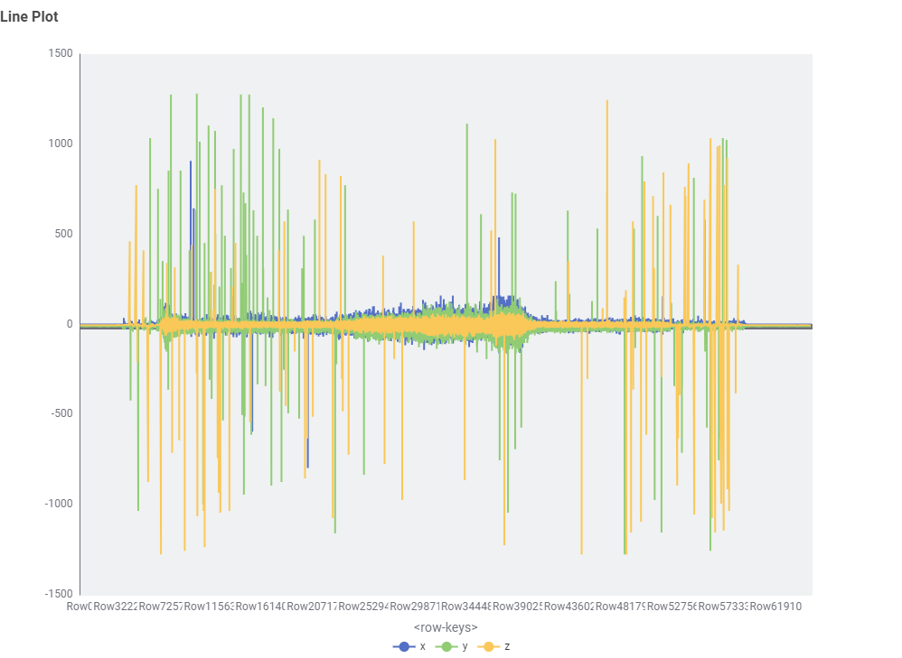Graph
: Example of recorded vibrations-graph of file 7

X-axis: sampling, Y-axis: acceleration m/s²

We take file 7 as an example, because it includes a complete operating
cycle. The quality of the data is not bad; it is possible to clearly
distinguish various areas of the graph corresponding to the various
regimes of the pump. However, in this file, as in all the others, some
anomalous peaks of very high magnitude (around 1000 m/s², compared to
about 50 m/s² for the other vibrations) are recorded. They are clearly
anomalies due to the strong vibrations of the pump (caused mainly by the
internal combustion engine), combined with the not very robust fixing
system of the sensor. I exclude that they are due to problems in the
acquisition system because, as you can see in the image below, they are
not present in the recording of accelerations when the pump is off.

<figure>
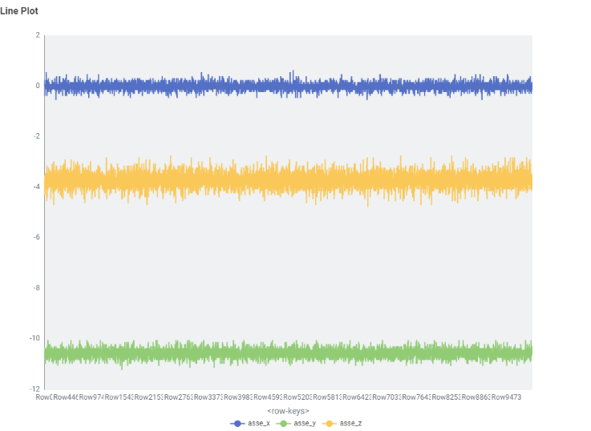
<figcaption><p>Image : Background vibration recorded when the motor pump
is switched off (file 6)</p></figcaption>
</figure>

X-axis: sampling, Y-axis: acceleration m/s²

I therefore decided to remove these anomalous peaks, and after some
different trials, given their very small number compared to the number
of samples, I decided to simply eliminate the rows containing values
above a certain threshold, identified by looking at the graph along the
various axes: *150 m/s² along the x and y axes, 100 m/s² along the z
axis.*

You get the following graph, much clearer and cleaner than before.

<figure>
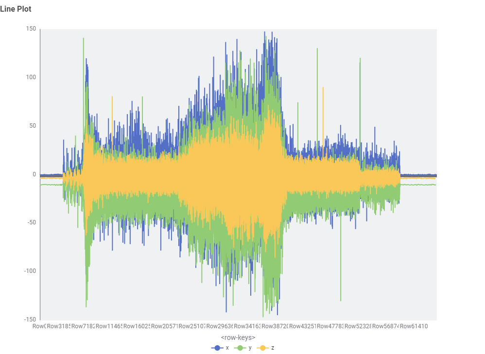
<figcaption><p>Image : Graph of file 7 after removing abnormal peaks.
It’s possible to see the vibration pattern much more
clearly.</p></figcaption>
</figure>

X-axis: Sampling

Y-axis: acceleration m/s²

**ANALYSIS OF DATA COLLECTED**

We can now better analyze the graph: the recording begins with the motor
of the pump off (almost zero vibrations), followed by 5 attempts of
pull-start ignitions that fail (the first 5 small peaks), followed by
the sixth pull that turns on the engine, shown by the sudden increase in
vibrations. For the ignition the gas lever is positioned almost at the
minimum. After a few minutes of running at low rpm, the engine is
gradually accelerated to the maximum speed, as can be seen by the
increasing vibrations. This is followed by a sharp deceleration to about
1/3 of the throttle, and after a few minutes, to idle. Then the pump is
turned off and the recording ends.

As it’s possible to see from this example, the recorded data allow to
clearly identify the various operating regimes of the pump, and the
vibrations meet what we expect to see, thus forming a good starting
point for the work to be done.

After completing the processing and an initial analysis of the data, I
started designing the structure of the autoencoder.

5.  **THE MODELS**

The initial idea was to work with the Fourier transform to expand the
dataset with more features. After some trials, this approach was
discarded due to poor results and the high computational cost, both
during training and inference on the ESP32. Thus, it was decided to stay
in the time domain.

I produced two versions of the model. Recorded data files number
1,2,4,5,9 were used for training and file 3 for validation. Files 7 and
8 were kept as never-before-seen samples for further evaluation of
network performance.

**VIBRATORY SIGNAL PREDICTION-SMALL AUTOENCODER**

The first idea, since we have 3 data points for each sample (triplet
X,Y,Z), was to keep the analysis in the "real" world and create an
autoencoder that has the input layer of dimension 3, and compresses it,
with this shape:

<figure>
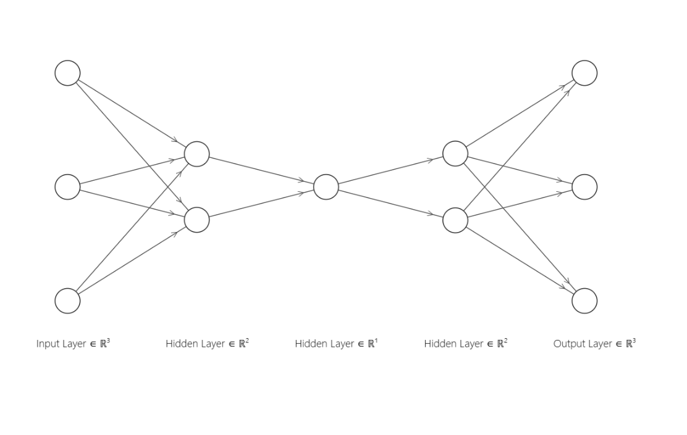
<figcaption><p>Image : Autoencoder structure for vibration prediction in
3 dimensions</p></figcaption>
</figure>

The activation function of the neurons is ReLU in the intermediate and
input layers, and linear in the output layer.

Let's see the workflow used for the training and validation of this
network:

<figure>
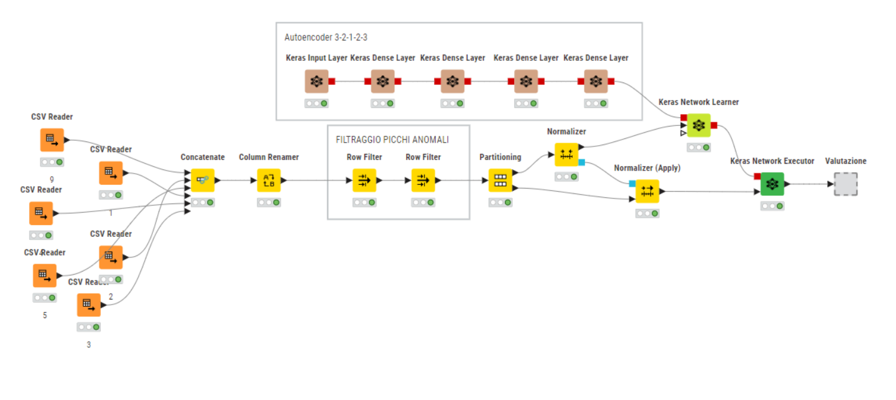
<figcaption><p>Image : Knime WF for 3-dimensional autoencoder training
and validation</p></figcaption>
</figure>

After loading the data and removing the anomalous peaks, they are
normalized peak-to-peak between 0 and 1 and given as input to the
network learner, associated with a neural network with the structure
described above. The network learner uses "Mean Squared Error" as Loss
Function and Adam as optimizer, leaving the default parameters. It is
important to remember to turn off data mixing before training, since we
are dealing with time series.

Let's see the results of the algorithm on the following page: even with
a quick look at the graphs containing real and predicted values, shown
below, you can see that the model is able to grasp a certain pattern in
the data and reproduce its trend (at least in the x and y axes, the z
axis is more problematic), however by failing to predict the precise
value in the various points, underestimating it, producing a similar but
"scaled" version of vibration.

NB. The graphs have been de-normalized to better see the difference
between predicted and real values.

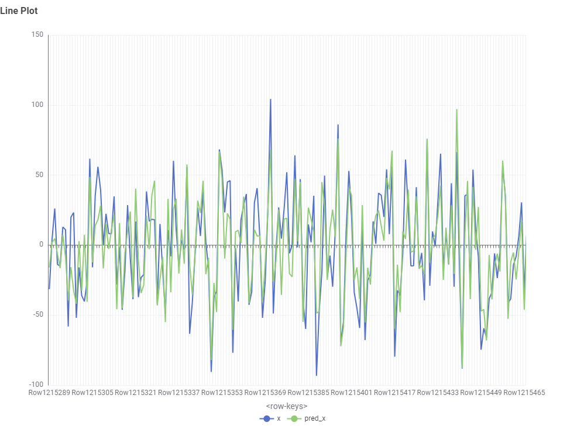

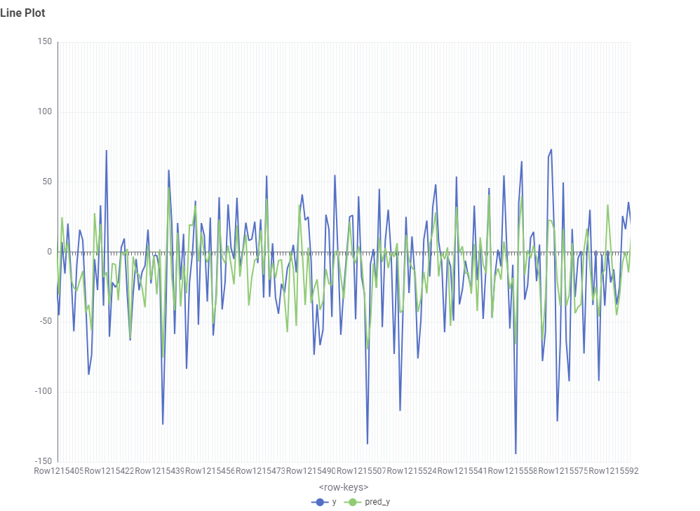

<figure>
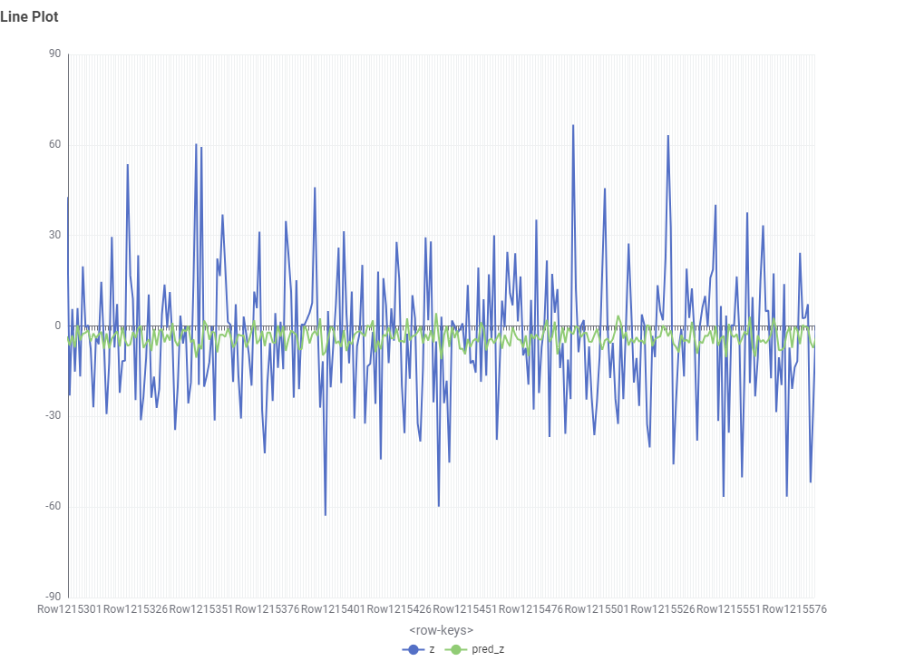
<figcaption><p>Graph a-b-c: detail of the comparison between real and
predicted value by the algorithm in 3 dimensions on x,y,z
axis</p></figcaption>
</figure>

X-axes: sampling, Y-axes: acceleration m/s²

As a first test of the algorithm, even at a glance and without
additional calculations or more precise assessments, it’s clear that the
current version is not yet suitable for practical use—but it’s not
entirely discouraging either. Given these promising initial results, we
can proceed to optimize the solution.

**EXTENDED VIBRATORY-AUTOENCODER SIGNAL PREDICTION**

The first strategy adopted for optimization is to increase the size of
the neural network. The Bottleneck layer must be smaller than our data;
I tried with dimension of 2 neurons. We model the network accordingly,
doubling the neurons for each layer. The following structure is
obtained:

<figure>
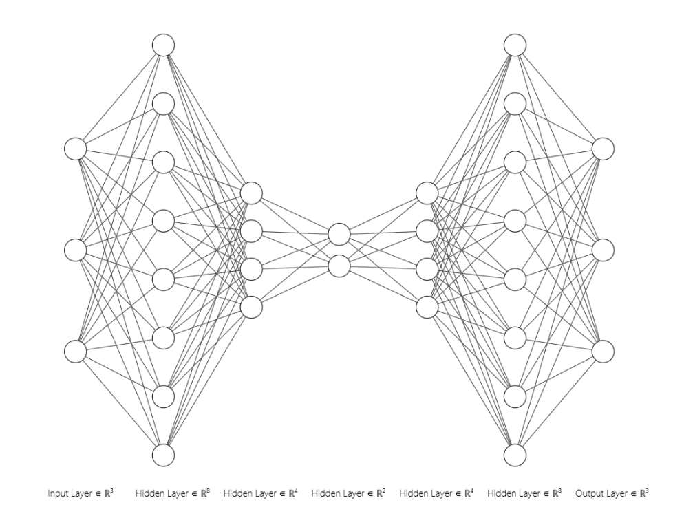
<figcaption><p>Image : Extended-size autoencoder
structure</p></figcaption>
</figure>

From dimension 3 of our data the three axes), we expand it and then
gradually compress it down to dimension 2. Subsequently, in the decoder,
they are re-expanded to size 8 and then, to restore them to their
original shape, brought back to size 3. In this case, the activation
function used in neurons is Sigmoid; The network learner uses the same
parameters as in the previous case.

Overall, the workflow for network training and validation is as follows.

<figure>
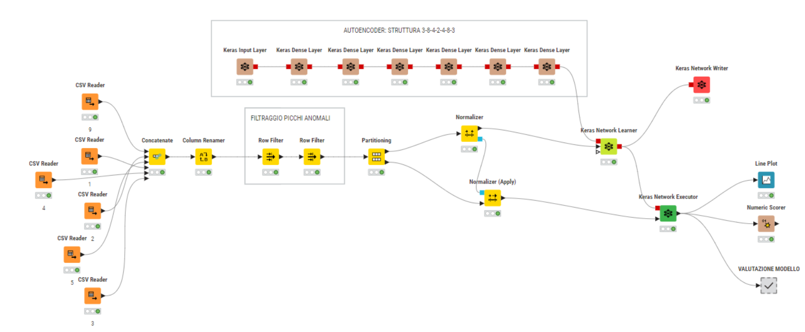
<figcaption><p>Image : Knime WF for the training and the validation of
the extended size autoencoder</p></figcaption>
</figure>

In detail, the data files saved in .csv are read by the CSV Reader node,
one per file, and merged into a single table by the Concatenate node;
This is easily possible because the files are all saved in the same
format:

***"Timestamp" x y z***

*(e.g. "gg/mm/yyyy hh:mm:ss" -5.33 -15.85 10.36).*

An identifying name is given to the columns we are interested in, x, y,
and z; we won’t use the timestamp, so we don't rename it. Then, there is
the filtering of the anomalous peaks: with two Row filter nodes we
delete all rows containing values larger, in modulus, of 150
m/s<sup>2</sup> on the x and y axes, and 100 m/s<sup>2</sup> on the z
axis. Now that we have the data ready to be used, they are divided
(Partitioning): 70% for training, 30% for validation. Both partitions
are normalized peak-to-peak to \[0,1\].

The training data partition is given as input to the Network Learner
node set with the parameters specified above, together with the neural
network to be trained, created with the Keras Dense Layer nodes in the
structure shown above (3-8-4-2-4-8-3).

The result of this node is the trained neural network; we can export it
with the Keras Network Writer node to upload it to EdgeImpulse for
further processing, and we give it as input to the Keras Network
Executor node, together with the part of the data kept for validation.
The Executor node "executes" the neural network on the input data
producing inferences, giving as output a table with the 3 starting
values and the 3 predicted values reconstructed by the model. We can now
analyze the results obtained with our neural network. We show them on a
graph, with the Line plot node, we calculate the performance of the
model, with the Numeric scorer node (whose output is presented at the
beginning of the next chapter) and we give them as input to a component
created by me that deals with more in-depth mathematical evaluations,
reported in the following chapter.

6.  **MODEL EVALUATION**

**PERFORMANCE ACHIEVED**

First, let's see some standard parameters to evaluate the correctness of
a model, calculated with Knime's Numeric Scorer node:

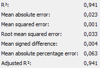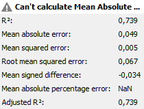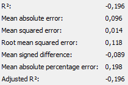

> x y z

Image a-b-c: Knime numeric scorer node output on x,y,z axis for the
final trained model

The parameters are very good for the x and y axes, but poor on the z
axis.

This is clearly visible by plotting the original and predicted data on a
graph. Let's see as an example a zoom on the graph for the 3 axes, in
which we can see point by point the quality of the inferences.

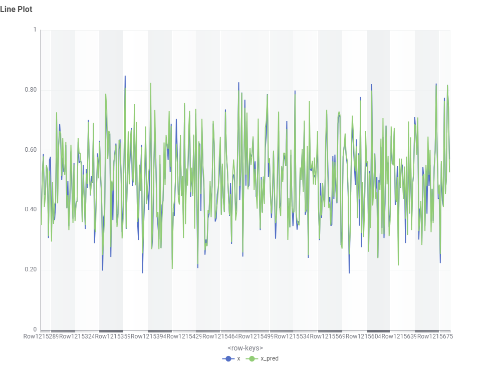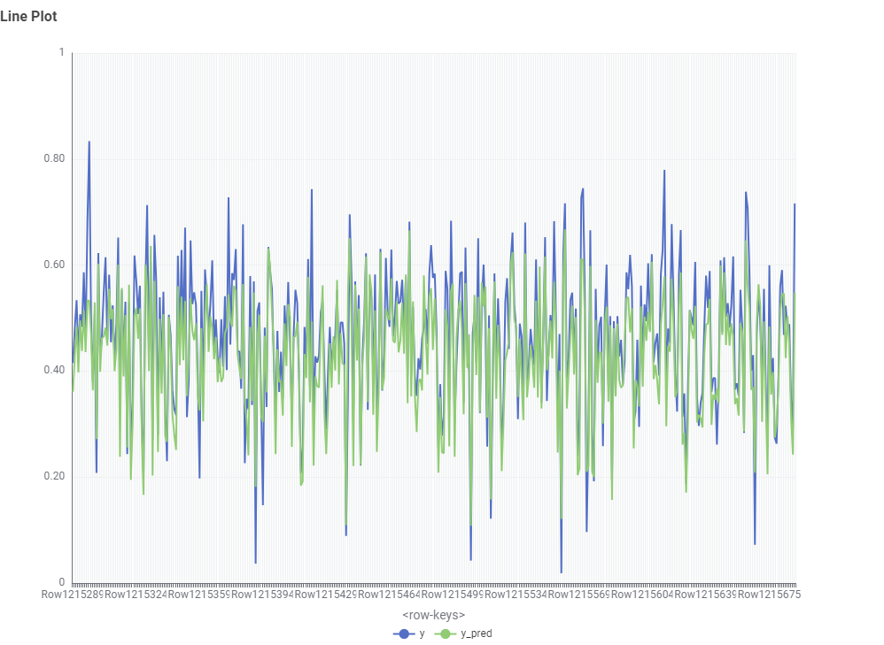

<figure>
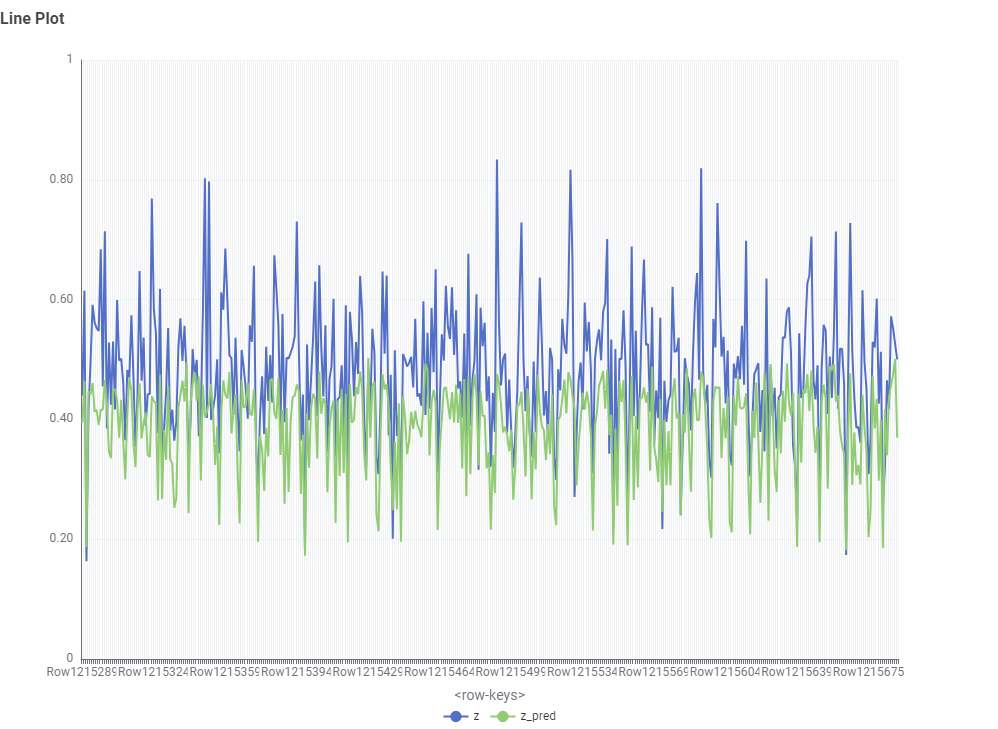
<figcaption><p>Graph a-b-c: Detail of the comparison between real and
predicted values by the model along the 3 axes. You can clearly see the
deterioration in the quality of the inferences on the z-axis, as we
expect from the output of the Numeric Scorer node</p></figcaption>
</figure>

X-axes: sampling, Y-axes: acceleration m/s²

Let's now study in detail the performance of the model on a complete
dataset; In particular, we use file 7, a dataset not used in training,
so with completely new data for the model, data that represent a
complete operating cycle: ignition, operation at various speeds from
idle to maximum, return to idle and shutdown. All the operating
situations in which the pump can work are contained.

First, let's see the complete forecast on the entire dataset; For each
axis there is a detail, like the previous ones, with a zoom on a narrow
area of the graph in which it’s possible to see the forecast point by
point.

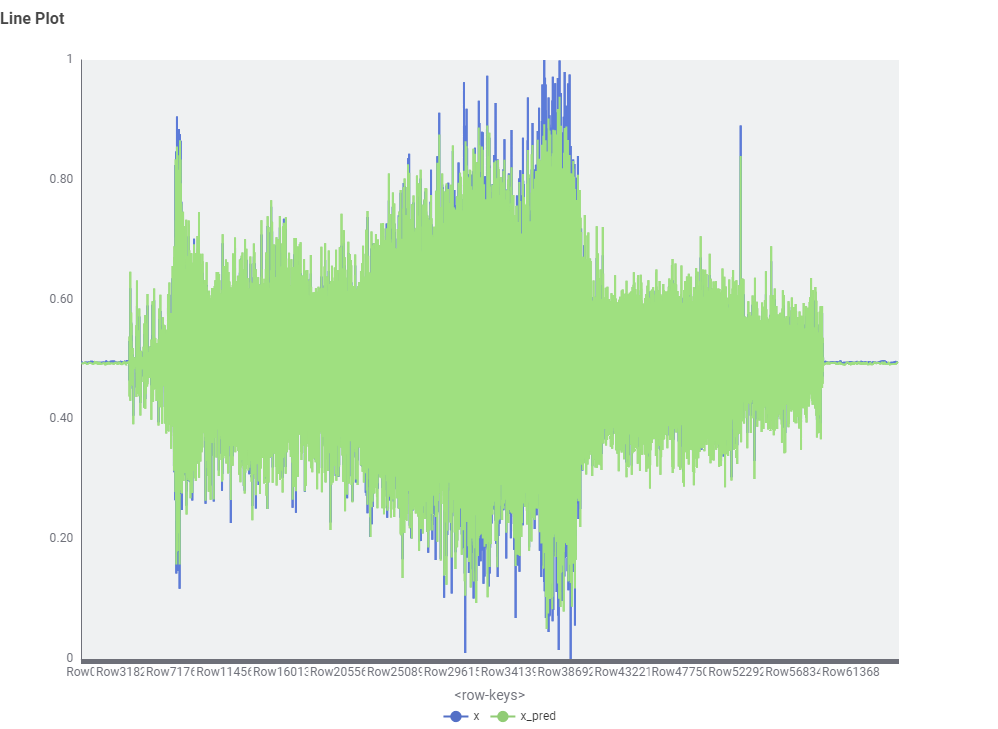

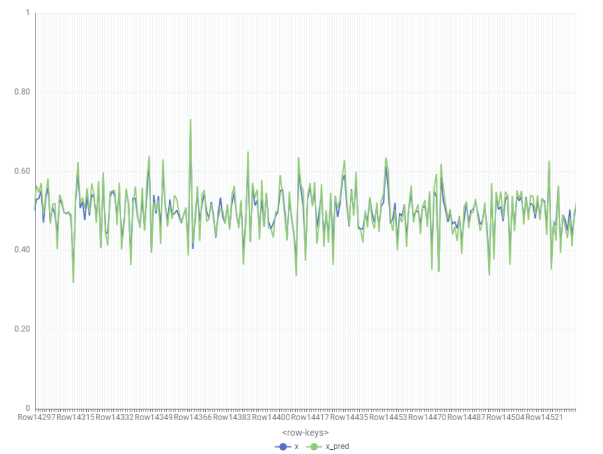

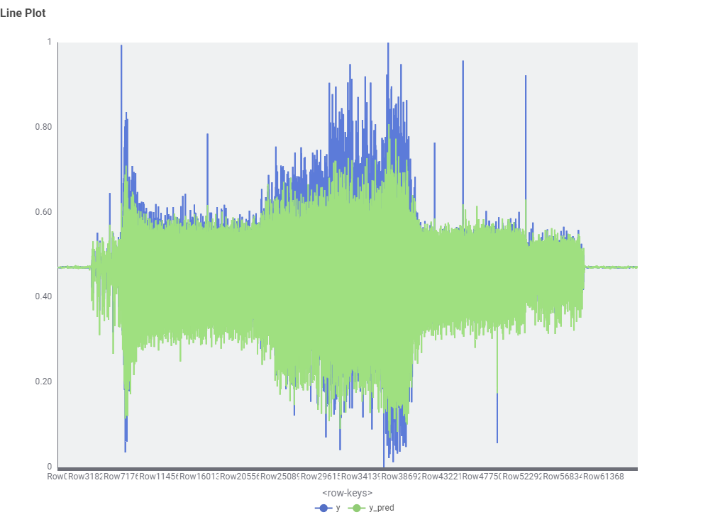

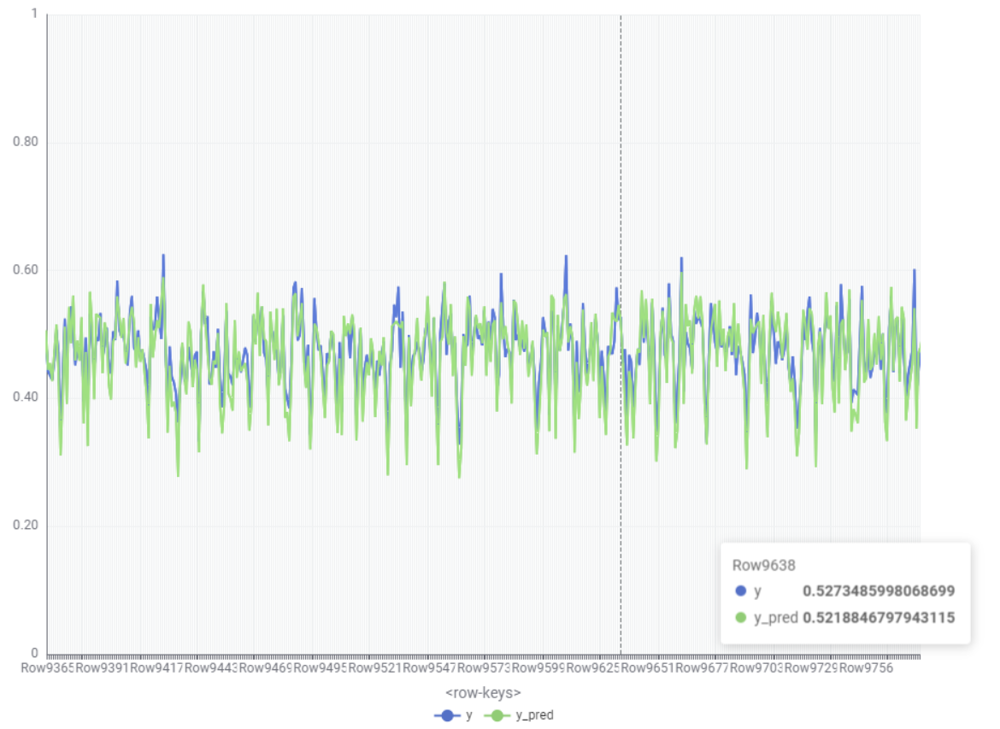

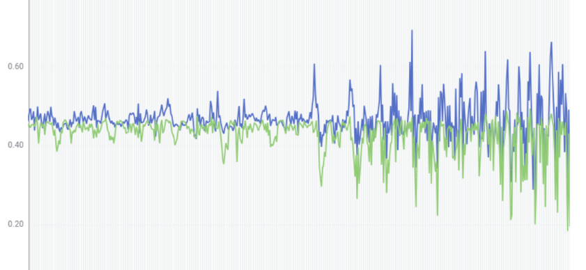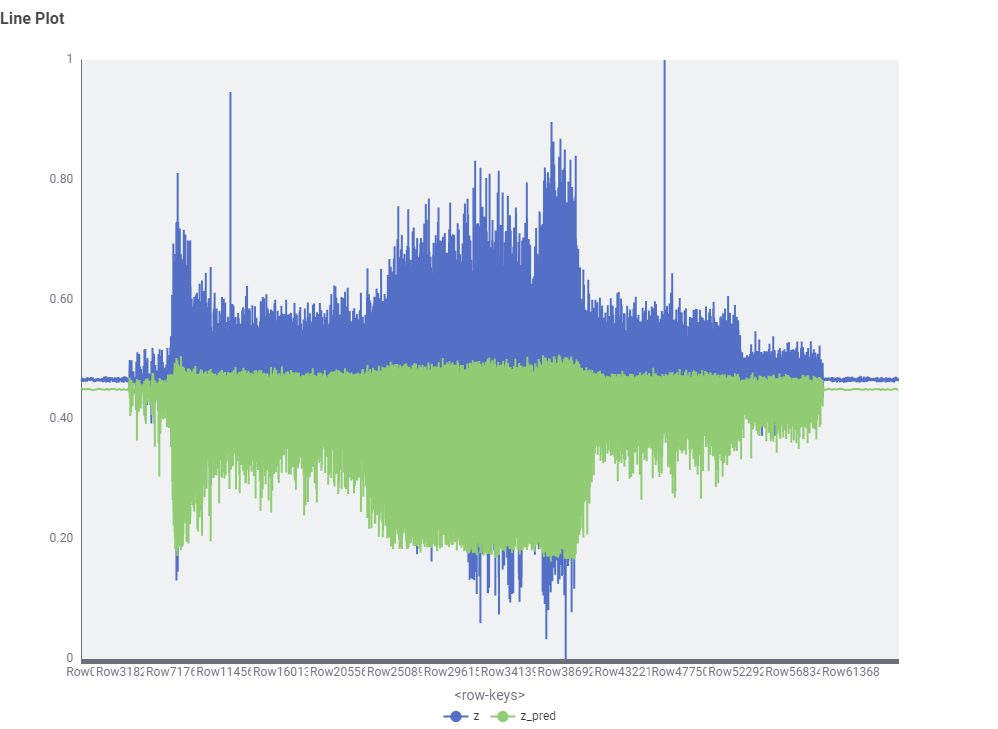

Graph 5 A-B-C: overall comparison and detail between predicted and real
value, on x,y,z axis

X-axes: Sampling

Y-axis: acceleration m/s²

To better evaluate the actual goodness of the algorithm, in addition to
the parameters provided by Knime's Numeric Scorer node, which in any
case indicate a good accuracy of the predictions, I used the following
method, which is also useful to visualize and better understand the
actual performance of the model in the aim of its practical use.

For each point, on all three axes, the difference between the value
predicted by the model and the real value is calculated; We call this
difference delta.

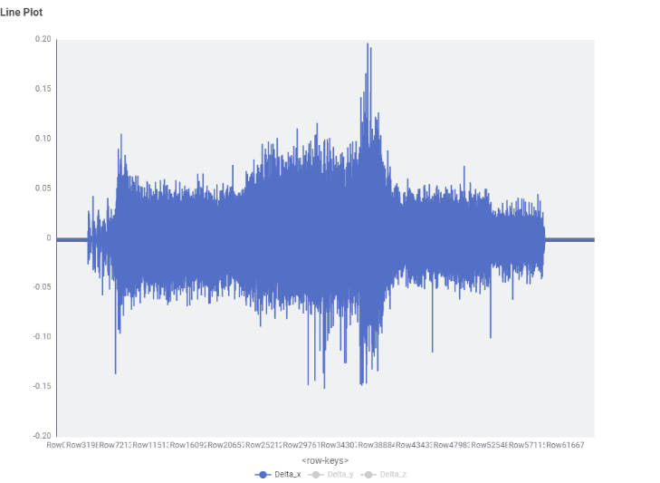
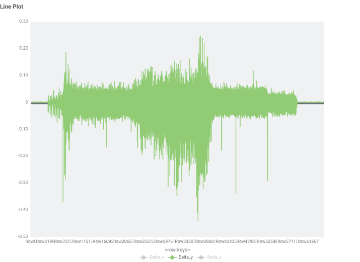

<figure>
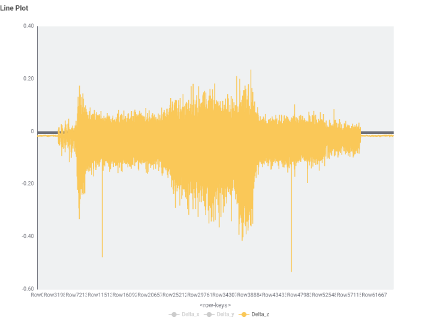
<figcaption><p>Graph A-B-C: punctual error made in the prevision on the
3 axes</p></figcaption>
</figure>

X-axes: Sampling

Y-axis: acceleration m/s²

For a more accurate comparison, I chose to evaluate overall how wrong
the prediction is on all three axes together; for each sampling instant
and therefore for each inference, the RMS average of the deltas on the
three axes is calculated.

``` math
RMS = \sqrt{\frac{delta_{x}^{2} + delta_{y}^{2} + delta_{z}²}{3}}
```

Making a mistake at a single point is not significant for anomaly
detection; A single or few abnormal data can be caused by many temporary
factors, even a shock or a small movement of the pump. Rather, we are
interested to check if we are making prediction errors continuously over
a certain period of time. We then calculate the arithmetic mean of the
RMS error once every 50 samples; If the error in this window is high,
then we might be encountering an anomaly, and some actions will be
taken. If not, the pump is operating normally.

<figure>
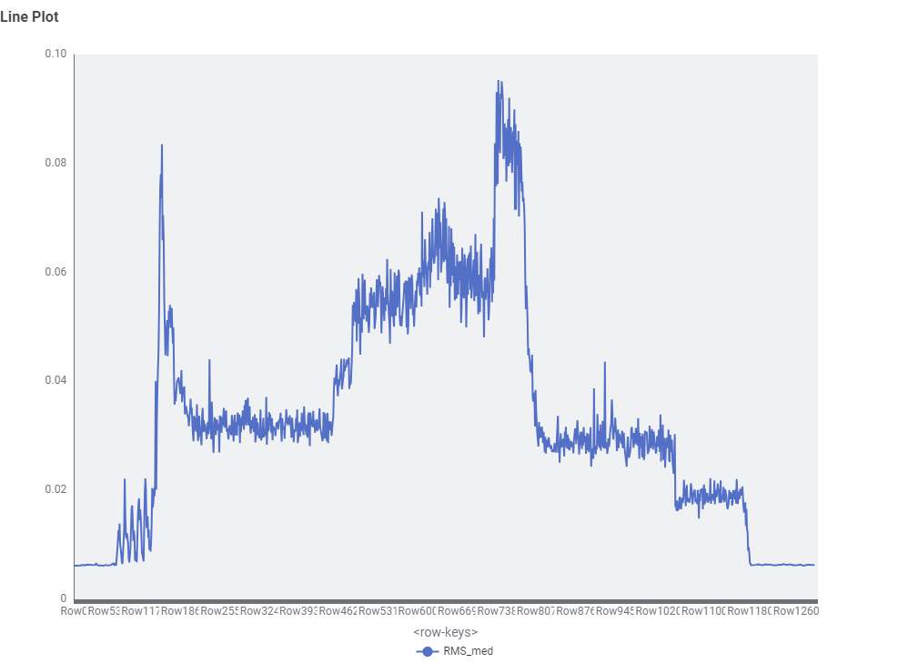
<figcaption><p>Graph : RMS error on the three axes on 50-sample
windows</p></figcaption>
</figure>

x-axis: data windows

Y-axis: reconstruction error m/s²

Combining the data in this way, it can be observed that the prediction
error is very low: the RMS of the error is in fact always less than 0.1,
i.e. with a magnitude less than 10% compared to the value of the data
(the amplitude of the vibration), considering that the latter are
normalized in the range \[0.1\] before processing. All evaluation phases
were carried out in Knime, with the following WF.

<figure>
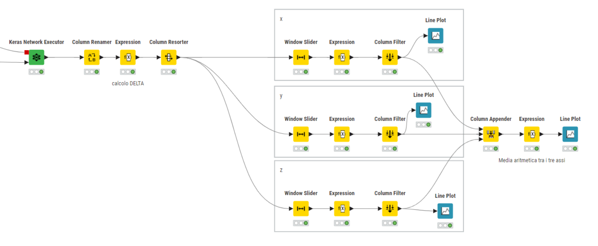
<figcaption><p>Image : A part of the workflow used to evaluate the
model. The different datasets used for the evaluation are connected to
the Network Executor node, together with the previously trained
autoencoder</p></figcaption>
</figure>

The last step is to calculate the optimal error threshold to distinguish
normal and anomalous situations, i.e. the maximum tolerance we have on
the error of the model's predictions.

**CALCULATION OF NORMAL-ABNORMAL LIMIT THRESHOLD**

To determine the error threshold beyond which vibrations are considered
anomalous, we apply the empirical rule of statistics (or three-sigma
rule) to the mean reconstruction error computed from the data (RMS_med),
as shown above.

The threshold $`\tau`$ is defined as

``` math
\tau = \mu + k\sigma
```

where:

μ is the average of errors

σ their standard deviation

k a coefficient defined by the rule, which is generally chosen from
1,2,3.

<figure>
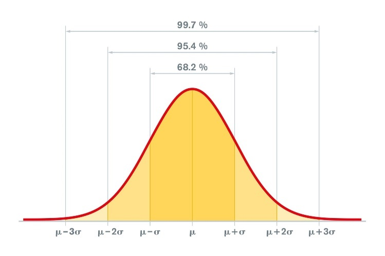
<figcaption><p>Image : Gaussian curve with 3 sigma rule</p></figcaption>
</figure>

In this case, I choose k=3*,* which allows to find even slight anomalies
but is not too narrow to risk generating false positives.

The value of $`\tau`$ calculated is therefore

$`\tau = \mu + 3\sigma =`$ 0.33 + 3\*0.02 = 0.093 ≈ 0.1

All value windows with an error above this threshold will be considered
anomalous.

We now have everything we need to complete the project.

7.  **DEPLOYMENT: EDGEIMPULSE**

**FROM THE MODEL TO THE APPLICATION**

Once we have obtained and tested the final model which meets the desired
characteristics, we export it from Knime with the appropriate node. The
saved file is in ". HDF5", a format used to store large amounts of data
and therefore suitable for a neural network (although in our case it is
small-sized).

The .H5 does not contain the model itself but only the information about
the weights, biases and configuration of the various neurons.

To be able to run it on a microcontroller such as the ESP32, we have to
transform it into a model suitable for tinyML, lightening it and
adapting it to a simpler architecture. It’s here where EdgeImpulse
really makes the difference and allows us to achieve our goal and obtain
a portable, powerful device for the cavitation detection.

Before working with EdgeImpulse, the model needs to be converted from
.H5 to .tflite; this can be easily done with a Python script, using the
TensorFlow library.

Then I uploaded the obtained ".tflite" file on EdgeImpulse, using the
BYOM feature.

EdgeImpulse is an online service for tinyML which, among other
possibilities, allows you to convert a specific ML model into executable
code for different kinds of microcontrollers, optimizing it and
"building" the instructions that can be executed by the small processor
(in our case in C code) to make inferences on the input data.

It allows you to specify a destination hardware for your model, that in
this case is the ESP32 *(ESP-EYE (ESP32 240MHz))*, as said before. I
left all the default parameters, selected TensorFlow as the compiler and
Arduino library as the output. After the computation, we can download
the resulting file.

The produced library is a normal Arduino library. We import it into the
IDE and can now use it in our sketches. There are some example codes
that we can use as a basis for our programs. From them, and especially
from the “static buffer” sketch, we move on to the realization of the
final program to be executed on the ESP32.

**THE CODE**

To implement the model and effectively do the anomaly detection, the
code will have to read the input data from the accelerometer, pass it to
the functions of the previously produced library "containing" the model,
perform the inference, and then calculate the error made in the
reconstruction of the data, comparing the computed data with the input
data.

If the error is below the previously determined safety threshold, it
means that the model is able to reconstruct the data well, and since it
has been trained only on normal operating data, we are facing a normal
situation. If, on the other hand, the error made in the reconstruction
of the data is high, the model struggles to reconstruct the data,
meaning that they are following a “new pattern”, probably because they
are anomalies. In this second case, the pump must be stopped to avoid
possible damage.

The code is developed on Arduino IDE using Arduino’s programming
language (a variation of C), and then deployed to the ESP32 with the
same software.

8.  **COMPLETE PRODUCT HYPOTHESIS**

A possible approach to shut off the pump when a fault is detected is to
insert a normally closed relay in the ignition circuit of the engine.
When triggered by a signal from the ESP32, the relay opens, cutting off
power to the spark plug and consequently stopping the engine. To achieve
this, the code includes an instruction to “turn off” a digital output
pin on the board, which is normally powered, and which the relay will be
connected to appropriately. The exact wiring of the shutdown hardware
will need to be determined based on the specific motor pumps to which
the system is applied. A generic example is illustrated in the diagram
below.

<figure>
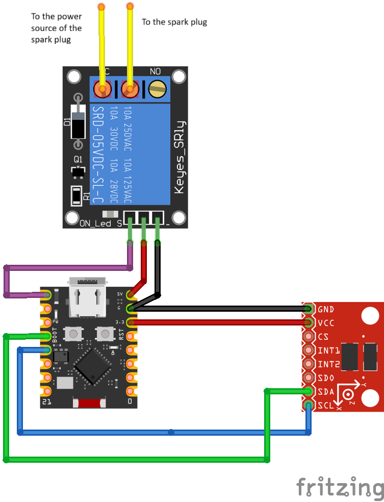
<figcaption><p>Image : Circuit hypothesis for an anomaly detection and
shutdown product in case of problems</p></figcaption>
</figure>

9.  **TESTS**

Due to the limited time available for the project so far and the fact
that it is not possible to risk a pump for testing, no real trials,
carried out by inducing cavitation and making the product work to stop
it have been conducted yet.

Waiting to have the budget or the opportunity to employ a sacrificial
pump in my test, I produced a script that simulates a cavitation event
to test the model with it.

**FINAL TEST: CAVITATION DETECTION ON ARTIFICIAL DATASET**

The fictitious dataset was produced by modifying file 7, already used
previously for evaluation, adding a fictitious cavitation episode to it.
The original file was processed with a custom-made Python script
inserted in the special Knime node that adds in the middle of the
dataset of disturbances, lasting 20% of the total data, similar to what
a real cavitation event can be according to the literature.

\+

Image : Disturbances added to the vibration signal to create a fake
cavitation event (x(t) original signal, y(t) noisy signal)

The introduced disturbance contains both continuous noise in a specific
band (conceivable with a cavitation event) and impulsive peaks of high
intensity, all modulated with AM modulation. This allows to slowly
variate the amplitude of the introduced disturbance, simulating how
cavitation occurs, not in a clear and uniform way, but gradually, with
more intense peaks and less active areas. The obtained dataset is the
following.

<figure>

<figcaption><p>Graph : The fake-cavitation dataset created. The noise
has been added in the middle part of the file, where the red line is
higher than 0.</p></figcaption>
</figure>

X-axis: Sampling

Y-axis: acceleration m/s²

Although the fictitious event introduced is probably not realistic for
our motor pump—given that we do not have this type of data for it—we can
still consider the test valid. Our goal is simply to verify whether we
are able to detect an anomaly within normal operating data, without
focusing on the specific nature of the anomaly itself. By giving the
dataset produced as input to the WF used for the evaluation of the
model, we obtain this result

<figure>
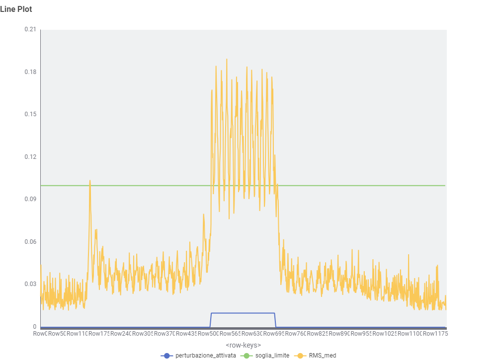
<figcaption><p>Graph 9: Reconstruction error on the anomalous
data.</p></figcaption>
</figure>

x-axis: data windows, y-axis: peak-to-peak normalized vibration
amplitude in \[0,1\]

We clearly notice that the performance of the model in reconstructing
anomalous data deteriorates significantly. Calculating, as before, the
reconstruction error committed in the various data windows, when the
disturbance is present, the error is around 13% of the amplitude of the
vibration (0.13 in an interval \[0,1\], i.e. the peak-to-peak
normalization of the vibratory signal), much greater than the 0.05
obtained in the part of the dataset left unchanged, and higher than the
limit threshold value τ calculated.

10. **CONCLUSIONS:**

The experimental activity carried out for this work has enabled the
development of a first version of an anomaly-detection and shutdown
system for motor pumps. This prototype appears to operate correctly,
although with non-optimal performance, thereby confirming both the
validity of the initial concept and the design choices made.

In particular, the model shows excellent predictive capability on the X
and Y axes—well beyond expectations—while its performance on the Z axis
is significantly weaker, as the signal is truncated in the positive
range. Despite multiple retraining attempts and detailed analysis, I was
unable to identify the root cause of this issue or fully resolve it;
however, it does not critically undermine the overall functioning of the
system.

Overall, the results obtained can be considered satisfactory in relation
to the set objectives and the time and resources available, and
represent a useful starting point for future developments and
optimizations.

11. **FUTURE DEVELOPMENTS:**

In light of the experience gained with this project and after all of the
critical issues encountered, it would be appropriate to change the
accelerometer model by opting for an analog one, with which we can
directly take care of the data acquisition, without being bound by the
specifications of a communication protocol. The idea of a digital
accelerometer, chosen to reduce the microcontroller tasks, getting rid
of data reading and processing, has posed some rigid constraints and
critical issues, especially in the datalogging phase. In addition, I
would opt for a model as small as possible, possibly a single chip not
soldered on a board, so that the fixing on the pump is easier and
firmer, maybe using the special double-sided adhesive tapes for
industrial applications, which I discovered after my measurement
campaign. In this way, the recorded data would certainly be more
faithful to reality and free from disturbances.

Once this hardware modification and related software changes have been
made to adapt it to the new setup, new measurements should be performed.

In particular, in addition to remeasuring the data on the same pump to
study its reproducibility and to understand how different accelerometer
mountings, even if made in the same way, can influence the measurements,
it would be interesting to carry out measurements on several pumps of
different models to understand how the vibrations of the motor pump can
vary in different cases.

Then, after acquiring a larger and more diverse dataset, the next step
would be to apply the model to these new vibration signals and evaluate
its performance. This would allow us to assess whether the model is
sufficiently general or whether it should be retrained on this more
varied data to improve its ability to generalize, moving closer to the
concept of transfer learning.

In conclusion, as said before, the most important step would be to test
the complete product on a sacrificial pump, inducing anomalies and
cavitation in it to check the real performance of the project.
